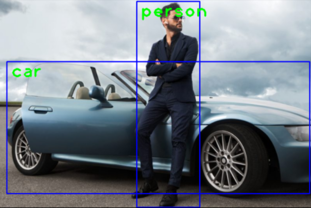

# Python Object detection

This project uses TensorFlow based frozen model and OpenCV python library for object detection of static images.

## Demo:

## Programming language:

- [Python](https://www.python.org/)

## Algorithm:

- [Single-Shot multibox Detection (SSD-MoblieNet version 3)](https://github.com/opencv/opencv/wiki/TensorFlow-Object-Detection-API)

## Dataset:

- [coco (80 classes)](https://github.com/nikhilsourav/object_detection/blob/main/labels.txt)

## Dependencies:

- [OpenCV](https://opencv.org/)
- [mathplotlib](https://matplotlib.org/)

## How to run?

- clone the repository to your local machine
- navigate to this cloned directory
- from the terminal install dependencies using these commands:
  - python -m pip install opencv-python
  - python -m pip install matplotlib
- after installing the dependencies run the main.py file from terminal using this command:
  - python main.py
- To analyze a different image change the image number in main.py line 27 to any number between 1 to 5
  - example:  
    `img = cv2.imread('images/img_1.jpg')` for first image  
    `img = cv2.imread('images/img_2.jpg')` for second image  
    and so on..

## Feel free to contribute to this project by providing more relevant images

 

# Thank you